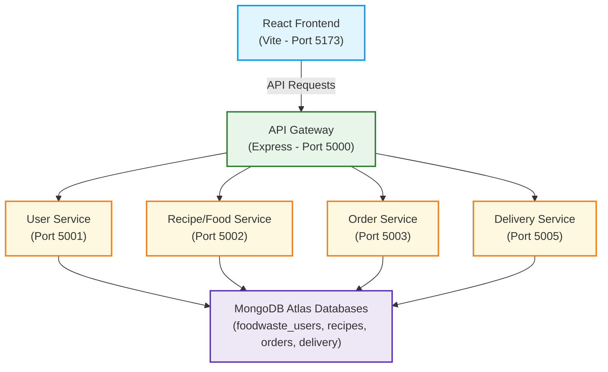
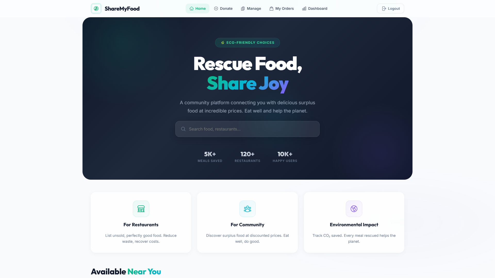
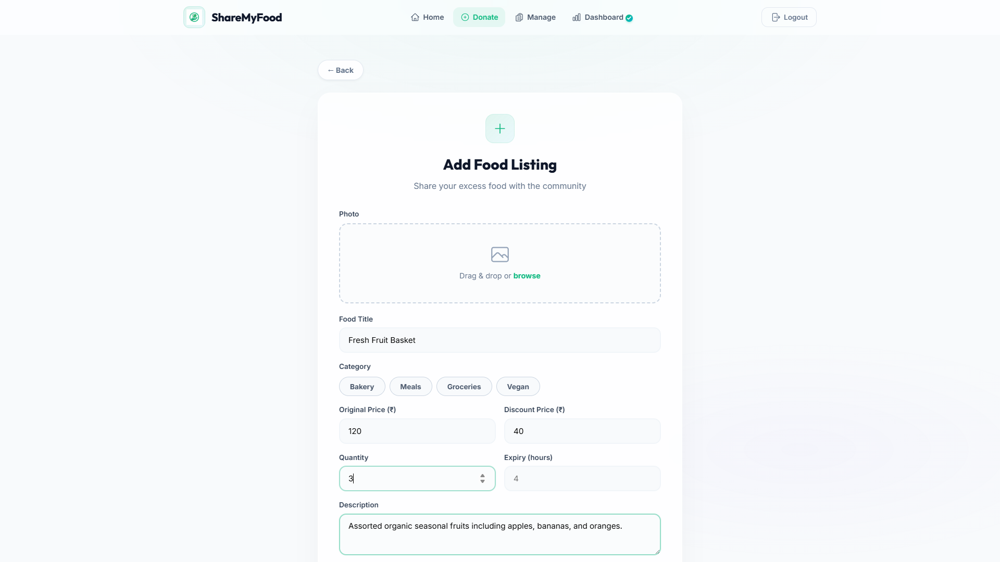
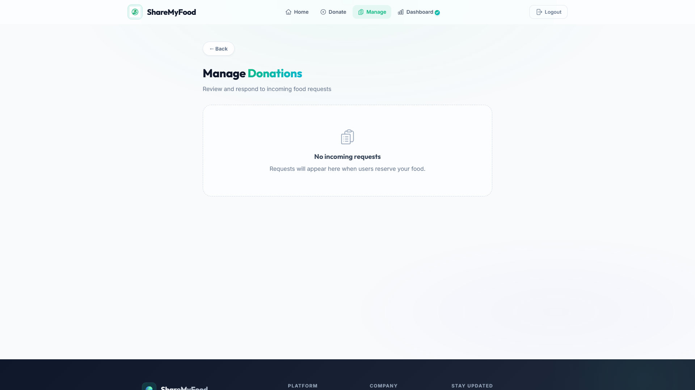
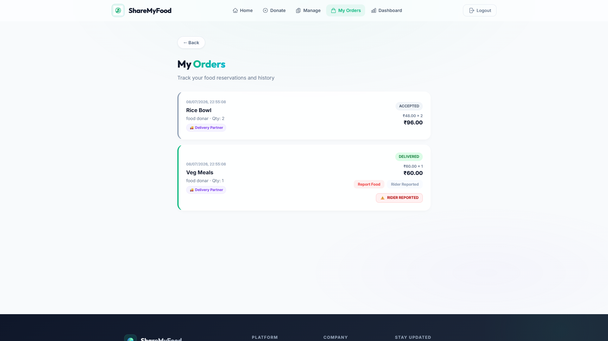
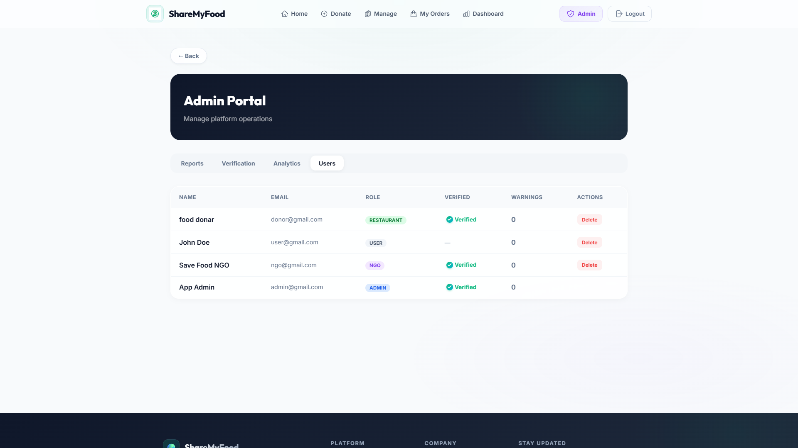
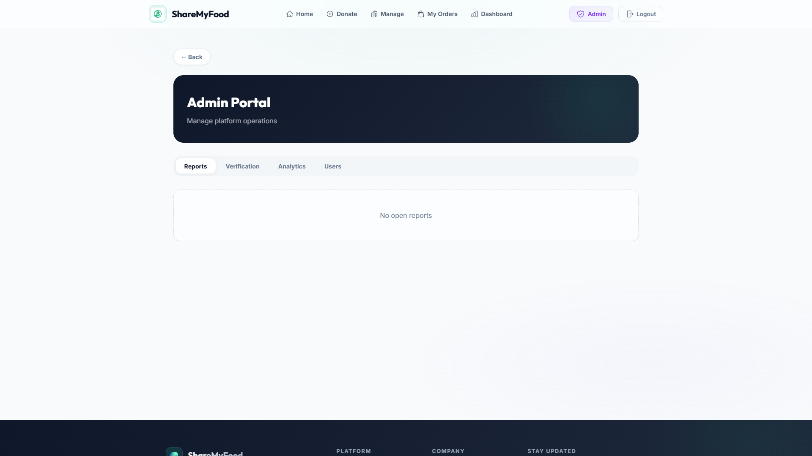

# ShareMyFood 🍱

A MERN Microservices Platform Connecting Food Donors, Users, NGOs, and Delivery Partners to Reduce Food Waste.

[](https://reactjs.org/)
[](https://nodejs.org/)
[](https://expressjs.com/)
[](https://www.mongodb.com/)
[](https://microservices.io/)
[](https://jwt.io/)
[](https://vercel.com/)
[](https://render.com/)

---

## 📌 Project Overview

**ShareMyFood** is a production-grade, full-stack food waste reduction platform built using a **MERN Microservices Architecture**. The platform serves as an ecological bridge connecting restaurants, individual food donors, general users, non-governmental organizations (NGOs), and delivery riders. 

By listing surplus edible food at heavily discounted prices (or as free donations), restaurants and donors help divert food from landfills. General users can purchase these meals at low prices, while verified NGOs have exclusive access to claim large food donations for direct distribution to vulnerable communities.

This project is built using a highly decoupled microservices pattern and integrates dynamically with the **Deliver My Food** delivery partner platform to manage active dispatches, rider lifecycles, and real-time delivery status updates.

---

## 🏗️ System Architecture

ShareMyFood uses an API Gateway routing pattern to ensure secure, rate-limited, and centralized entry. Each microservice manages its own isolated database schema (database-per-service pattern) to enforce strict service boundaries.



### 🧩 Services Breakdown

| Service Name | Port | Description |
| :--- | :---: | :--- |
| **API Gateway** | `5000` | Manages reverse proxying, CORS rules, preflight routing, and request forwarding. |
| **User Service** | `5001` | Coordinates user registration, login, JWT authorization, and profile moderation status. |
| **Recipe Service** | `5002` | Manages food postings, categories, search queries, availability durations, and NGO restrictions. |
| **Order Service** | `5003` | Processes purchases, donation claims, checkout rules, and driver assignment alerts. |
| **Notification Service** | `5004` | Logs system alerts, and structures notification formats. |
| **Delivery Service** | `5005` | Interfaces with the peer **Deliver My Food** system to dispatch orders and fetch rider location statuses. |

---

## ⚡ Role-Based Features

### 👤 Regular User
* **Browse Surpluses**: Browse and filter active local listings by distance, price, category, and availability.
* **Seamless Checkout**: Order food listings for low prices with cash-on-delivery (COD) settings.
* **Order Tracking**: Follow active delivery status from pickup to drop-off.
* **Rider Feedback**: Rate delivery riders and file formal reports in case of misconduct.

### Donor / Restaurant
* **Surplus Listing**: Create listings with image attachments, original vs. discounted prices, quantities, and expiration hours.
* **NGO Designation**: Mark larger listings as "NGO Preferred" or "NGO Only" to target charity claims.
* **Order Management**: Accept or reject order requests and coordinate dispatch.
* **Rider Rating/Reporting**: Report delivery riders to keep the logistics ecosystem professional.

### 🏢 NGO (Non-Governmental Organization)
* **Exclusive Access**: View and claim bulk donations marked specifically for NGOs.
* **Direct Claiming**: Order large-scale food packages for zero cost to support community kitchens.

### 🚚 Delivery Integration (Delivery Partner Platform)
* **Logistics Lifecycle**: Connected with the **Deliver My Food** rider app via the following lifecycle:
  ```
  Donor Approves Order ➔ Dispatch Request Generated ➔ Rider Accepts ➔ Rider Picked Up ➔ Delivered
  ```

### 🛡️ Administrator
* **User Control**: Block, review, verify, or restrict users, restaurants, and riders based on compliance issues.
* **Food Listing Moderation**: Moderate flagged listings and inspect system reports.
* **Rider Reports**: Process rider reports submitted by donors and users to issue warnings.

---

## 📸 Screenshots

### Home Page


### Add Food Listing


### Donor Dashboard


### User Orders & Delivery Tracking


### Admin Portal & User Management


### Food Report Moderation


---

## 🛠️ Tech Stack

* **Frontend**: React (Vite), Vanilla CSS (Flexbox/Grid), Axios, Lucide Icons, React Router DOM
* **Backend**: Node.js, Express.js, Axios, CORS, http-proxy-middleware
* **Database**: MongoDB Atlas, Mongoose ODM
* **Deployment**: Vercel (Frontend), Render (Microservices API Gateway & Databases)

---

## 📂 Project Structure

```text
ShareMyFood/
├── app/
│   ├── api-gateway/            # Express gateway reverse-proxying microservices
│   ├── delivery-service/       # Delivery dispatch microservice
│   ├── frontend/               # React (Vite) client interface
│   ├── notification-service/   # Logs and mock email notification microservice
│   ├── order-service/          # Order checkout and claim management microservice
│   ├── recipe-service/         # Food item listings microservice
│   └── user-service/           # Identity provider microservice (JWT Auth)
├── screenshots/                # Visual documentation images
├── .gitignore                  # Git excluded file configurations
├── README.md                   # Project documentation
└── run_all_local.js            # Node service runner script to start all 7 servers
```

---

## ⚙️ Local Installation & Running

### Prerequisites
* **Node.js** (v16 or higher)
* **MongoDB** (running locally on port `27017` or configured Atlas Connection URI)

### Step 1: Install Dependencies
Navigate into each service folder and install node packages:
```bash
# Install core microservice dependencies
cd app/api-gateway && npm install
cd ../user-service && npm install
cd ../recipe-service && npm install
cd ../order-service && npm install
cd ../notification-service && npm install
cd ../delivery-service && npm install
cd ../frontend && npm install
```

### Step 2: Set Environment Variables
Microservices read environment variables from system environments or localized configurations. 

Example environment setup for local execution:
```env
PORT=5000
MONGO_URI=mongodb://localhost:27017/foodwaste_database
JWT_SECRET=your_jwt_signing_key_here
USER_SERVICE_URL=http://localhost:5001
RECIPE_SERVICE_URL=http://localhost:5002
ORDER_SERVICE_URL=http://localhost:5003
NOTIFICATION_SERVICE_URL=http://localhost:5004
DELIVERY_SERVICE_URL=http://localhost:5005
```
*(No real secrets or API keys are hardcoded in the codebase to guarantee security compliance).*

### Step 3: Run the Complete System
To start all 7 services concurrently (API Gateway, User Service, Recipe Service, Order Service, Notification Service, Delivery Service, and Vite Frontend), run the custom runner script in the project root:
```bash
node run_all_local.js
```
The runner script will boot all systems, direct their logs to `local_logs/`, and serve the user interface locally at: **[http://localhost:5173](http://localhost:5173)**.

---

## 🛡️ Security Features

1. **Cryptographic Protection**: Secure password storage utilizing `bcryptjs` hashing.
2. **Identity Providers**: Stateless authentication powered by signed JSON Web Tokens (JWT) stored client-side.
3. **RBAC**: Role-based access control protecting donor portals, NGO listings, and administration portals.
4. **Account Restricting**: Active checks checking account moderation states (restricted/deleted) on every layout mount to immediately log out non-compliant users.
5. **CORS Defenses**: Dynamic gateway CORS policies checking origins, validating preflight configurations, and removing downstream header conflicts.

---

## 🚀 Future Improvements

* **Real-time Map tracking**: Support map telemetry using Socket.io to show rider coordinates.
* **AI Quality Analytics**: Image-based freshness estimation using pre-trained computer vision models.
* **Native Mobile Apps**: React Native clients for both donor notifications and user ordering.
* **Advanced analytics dashboard**: Visual charts tracking food waste metrics, donation distributions, and platform performance.
* **Automated delivery assignment**: Smart dispatch algorithms to match nearby riders automatically.
* **Real-time notifications**: In-app push alerts for order updates and warnings.

---

## 👨‍💻 Author

**Gargeya Datta Hotur** - *Full Stack Developer*
* **GitHub**: [@dattahotur](https://github.com/dattahotur)
