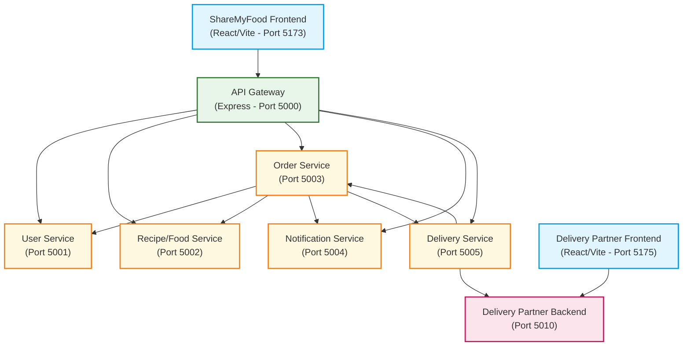

# ShareMyFood 🌍

ShareMyFood is a comprehensive, microservices-based MERN web application designed to reduce food waste. It connects customers, restaurants, NGOs, and delivery partners under a unified platform to facilitate food donation workflows and low-cost food purchasing. 

---

## 🏗️ Architecture & Services

The application follows a microservices architecture, routing all frontend client requests through an API Gateway. It integrates two frontend applications: the core **ShareMyFood Frontend** and the dedicated **Delivery Partner Frontend**.



### 🧩 Services Breakdown
*   **API Gateway (Port 5000)**: Serves as a single entry point, reverse-proxying incoming client traffic to the respective microservices.
*   **User Service (Port 5001)**: Manages authentication, authorization, and user profiles.
*   **Recipe/Food Service (Port 5002)**: Handles listings of available food items and recipes.
*   **Order Service (Port 5003)**: Manages purchases, donation claims, checkout flows, and coordinates with other services.
*   **Notification Service (Port 5004)**: Generates logs and coordinates email alerts.
*   **Delivery Service (Port 5005)**: Manages ride dispatching and tracks deliveries with the delivery partner application.
*   **Delivery Partner Backend (Port 5010)**: A separate service running in the peer workspace (`ibm2`) to handle rider operations.

---

## 🛠️ Tech Stack

*   **Frontend**: React.js, Vite, Tailwind CSS / Vanilla CSS, React Router, Axios
*   **Backend**: Node.js, Express.js, Axios, HTTP Proxy Middleware
*   **Database**: MongoDB (Microservice databases are separate to enforce database-per-service separation)
*   **Process Management**: Node `child_process` runner for local development
*   **Containerization**: Docker & Docker Compose

---

## 🚀 Running the App

### Prerequisites
*   [Node.js](https://nodejs.org/) (v16+)
*   [MongoDB](https://www.mongodb.com/try/download/community) (running locally on port `27017`)
*   *(Optional)* [Docker](https://www.docker.com/)

---

### Method 1: Using the Local Script Runner (Recommended)

You can launch all backend microservices and frontends concurrently with a single command:

1. Install dependencies for all services:
   ```bash
   cd app/api-gateway && npm install
   cd ../user-service && npm install
   cd ../recipe-service && npm install
   cd ../order-service && npm install
   cd ../notification-service && npm install
   cd ../delivery-service && npm install
   cd ../frontend && npm install
   ```
2. Navigate to the root directory and run:
   ```bash
   node run_all_local.js
   ```
This script will:
* Launch every microservice and frontend in the background.
* Stream unified logs prefixed by service name directly to your console.
* Save logs individually in the `local_logs/` folder.

---

### Method 2: Running with Docker Compose

If you have Docker installed, you can spin up the core environment using the configured container layout:

1. Navigate to the `app/` directory:
   ```bash
   cd app
   ```
2. Build and start all services:
   ```bash
   docker-compose up --build
   ```
3. Access the main user interface at **[http://localhost:5173](http://localhost:5173)**.

---

## 📂 Project Structure

```
ShareMyFood/
├── app/
│   ├── api-gateway/          # Express reverse-proxy
│   ├── user-service/         # User auth & profile management
│   ├── recipe-service/       # Food listings & recipes API
│   ├── order-service/        # Purchases & donation claims
│   ├── notification-service/ # Logs alerts and mock email systems
│   ├── delivery-service/     # Order delivery dispatches
│   ├── frontend/             # Core React app (Vite)
│   ├── docker-compose.yml    # Docker configuration
│   └── README.md             # Secondary documentation
├── local_logs/               # Generated run-time logs (Git ignored)
├── .gitignore                # Git ignore configurations
├── README.md                 # Primary documentation
└── run_all_local.js          # Unified local services runner script
```
